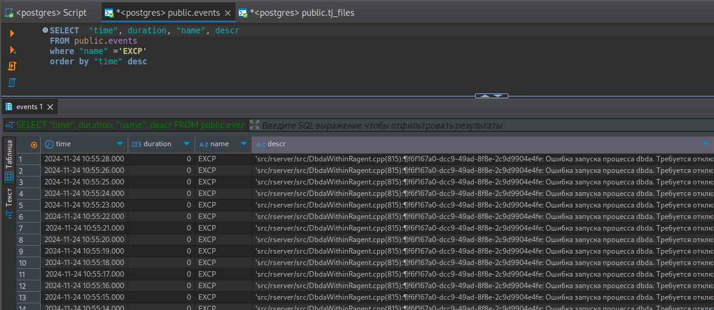

# Парсер 1С

[](https://github.com/farukshin/parser1c/releases)


[](https://github.com/farukshin/parser1c/blob/main/LICENSE.md)


Многопоточный парсер логов технологического журнала 1С с выгрузкой в PostgreSQL.

* [Установка](#install)
* * [Установка из исходников](#installSource)
* * [Установка из релизов](#installRelease)
* * [Установка из docker образа](#installDocker)
* [Использование](#usage)
* * [Запуск из консоли](#runcli)
* * [Запуск в docker образе](#rundocker)
* [Анализ логов технологического журнала в SQL](#sql)
* [Нашли ошибку?](#err)
* [Лицензия](#lic)
* [FAQ](#faq)


<a name="install"></a> 

## Установка

<a name="installSource"></a> 

### Установка из исходников

```
git clone https://github.com/farukshin/parser1c.git
cd parser1c
go build .
./parser1c --version
```

<a name="installRelease"></a> 

### Установка из релизов

1. Получить версию [последнего релиза](https://github.com/farukshin/parser1c/releases).

``` bash
VERSION=$(curl -s "https://api.github.com/repos/farukshin/parser1c/releases/latest" | jq -r '.tag_name')
```
Или установить необходимую версию релиза:

``` bash
VERSION=vX.Y.Z
```

2. Загрузка релиза

``` bash
OS=Linux       # or Darwin, Windows
ARCH=x86_64    # or arm64, x86_64, armv6, i386, s390x
FILE=parser1c_${OS}_${ARCH}.tar.gz
curl -sL "https://github.com/farukshin/parser1c/releases/download/${VERSION}/${FILE}" > ${FILE}
```

3. Проверка контрольной суммы

``` bash
curl -sL https://github.com/farukshin/parser1c/releases/download/${VERSION}/parser1c_checksums.txt > parser1c_checksums.txt
shasum --check --ignore-missing ./parser1c_checksums.txt
```

4. Распаковать парсер

``` bash
tar -zxvf ${FILE} parser1c
./parser1c --version
```

<a name="installDocker"></a> 

### Установка из docker образа

`parser1c` можно запустить из docker образа. Сам образ можно скачать из docker hub'a

```
docker push farukshin/parser1c
```
или собрать локально

```
git clone https://github.com/farukshin/parser1c.git
cd parser1c
docker build -t farukshin/parser1c .
```

Образ `farukshin/parser1c` создан на базе `scratch`, поэтому итоговый размер образа 5MB
```
docker images | grep "farukshin/parser1c"
> farukshin/parser1c                  v0.1.5    3a6752e4f686   13 minutes ago   5MB
```

<a name="usage"></a> 

## Использование

<a name="runcli"></a> 

### Запуск из консоли

```
Строка запуска: parser1c [Опции]

Опции:
-h --help - вызов справки
-v --version - версия приложения
--input - каталог с логами технологического журнала или имя файла с логами (либо env PARSER1C_INPUT)
--output - приемник, на данный момент только postgres (либо env PARSER1C_OUTPUT)
--host - хост PostgreSQL (либо env PG_HOST)
--port - порт PostgreSQL (либо env PG_PORT)
--user - пользователь PostgreSQL (либо env PG_USER)
--password - пароль PostgreSQL (либо env PG_PASSWORD)
--dbname - база данных PostgreSQL (либо env PG_DBNAME)
--countRuner - количество потоков парсера (либо env PARSER1C_COUNTRUNER, необязательный параметр, по умолчанию 1)
```

Допустим, в настройках сбора технологического журнала каталог сбора логов указан `/var/log/1c`:

```
<?xml version="1.0"?>
<config xmlns="http://v8.1c.ru/v8/tech-log">
    <log location="/var/log/1c" history="8">
    ...
```
И логи планируем хранить в PostgreSQL, запущенному по адресу `localhost` на порту `5432`, в базе данных `alsu`, пользователь `usrparser1c` и пароль `mypass`

Пример запуска парсера:

```
./parser1c --input=/var/log/1c \
    --output=postgres \
    --host=localhost \
    --port=5432 \
    --user=usrparser1c \
    --password=mypass \
    --countrunner=4 \
    --dbname=alsu
```

Параметры подключения к PostgreSQL можно указать в переменных окружения. 

``` bash
PG_HOST=localhost
PG_PORT=5432
PG_USER=usrparser1c
PG_PASSWORD=mypass
PG_DBNAME=alsu
```

Тогда строка запуска парсера будут:
```
./parser1c --input=/var/log/1c \
    --output=postgres \
    --countrunner=8
```

<a name="rundocker"></a> 

### Запуск в docker образе

Для запуска парсера ТЖ необходимо в контейнер пробросить каталог с логами ТЖ, через `volume`. Если логи на хостовой машине пишутся в `/var/log/1c`, тогда парсер можно запустить следующим образом:

```
docker run --rm \
    --volume /var/log/1c:/var/log/1c \
    -e PG_HOST='192.168.0.224' \
    -e PG_PORT='5432' \
    -e PG_USER='usrparser1c' \
    -e PG_PASSWORD='mypass' \
    -e PG_DBNAME='alsu' \
    -e PARSER1C_INPUT='/var/log/1c' \
    -e PARSER1C_OUTPUT='postgres' \
    farukshin/parser1c:v0.1.5
```

<a name="sql"></a> 

## Анализ логов технологического журнала в SQL

Для просмотра и анализа логов можно подключиться к базе любым удобным способом, например используя [DBeaver](https://dbeaver.io/)



<a name="err"></a> 

## Нашли ошибку?

Если при использовании `parser1c` нашли ошибку, не загружаются определенные события технологического журнала - создайте [новый issues](https://github.com/farukshin/parser1c/issues/new). Приложите пример файла `.log` технологического журнала для скорейшего исправления ошибки. Возможно, новое поле определенного события ТЖ добавилось с нового релиза платформы.

<a name="lic"></a> 

## Лицензия

`parser1c` выпускается под лицензией MIT. Подробнее [LICENSE.md](https://github.com/farukshin/parser1c/blob/main/LICENSE.md)

<a name="faq"></a> 

## FAQ

**Как часто выгружаются логи?**

Логи ТЖ в PostgreSQL выгружаются в режиме реального времени. Все добавляемые записи технологического журнала платформой в текущие файлы сразу попадают в PostgreSQL.

**Какая нагрузка на диски при считывании файлов повторно?**

Парсер не считывает уже отправленные данные с диска в оперативную память. Учитывается offset файла, считываются только новый байты, добавленные файл с момента предыдущей успешной выгрузки.

**Как правильно указать количество потоков (параметр --countrunner)?**

Если указать его больше чем ядер процессора, то не стоит ждать выигрыша в производительности.

**Какие события ТЖ поддерживаются?**

Поддерживаются все события ТЖ. При этом надо учитывать, что в новых релизах платформы 1С может добавить определенные поля в текущие события. Необходимо будет обновить `parser1c` до последнего релиза.